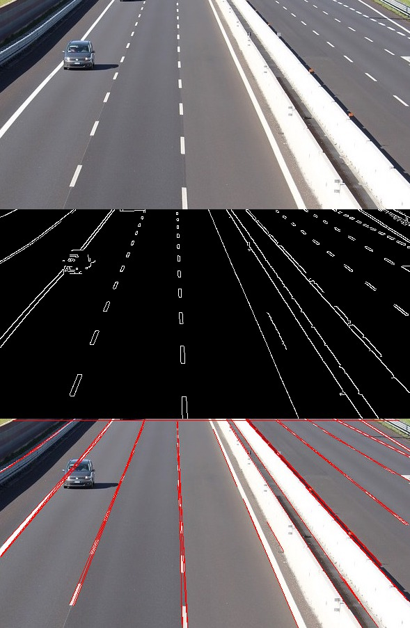

# HOUGH TRANSFORM

## INTRODUCTION

The Hough transform is a feature extraction technique used in image analysis, computer vision, and digital image processing. The purpose of the technique is to find imperfect instances of objects within a certain class of shapes by a ***voting procedure***. This voting procedure is carried out in a parameter space, from which object candidates are obtained as local maxima in a so-called accumulator space that is explicitly constructed by the algorithm for computing the Hough transform.

The classical Hough transform was concerned with the identification of lines in the image, but later the Hough transform has been extended to identifying positions of ***arbitrary shapes***, most ***commonly circles or ellipses***. The Hough transform as it is universally used today was invented by ***Richard Duda and Peter Hart in 1972***, who called it a ***"generalized Hough transform"*** after the related 1962 patent of Paul Hough.

Line Detection             |  Circle Detection
:-------------------------:|:-------------------------:
   |  
 

## LINE DETECTION

### Representation of Lines in the Hough Space

Lines can be represented uniquely by two parameters. Often the form in Equation 1 is used with parameters a and b:

This form is, however, not able to represent vertical lines. Therefore, the Hough transform uses the form in Equation 2, which can be rewritten to Equation 3 to be similar to Equation 1. The parameters θ and r is the angle of the line and the distance from the line to the origin respectively.

All lines can be represented in this form when θ ∈ [0, 180] and r ∈ R (or θ ∈ [0, 360] and r ≥ 0). The Hough space for lines has therefore these two dimensions; θ and r, and a line is represented by a single point, corresponding to a unique set of parameters (θ0, r0). The line to-point mapping is illustrated in Figure 1.

### Mapping of Points to Hough Space

An important concept for the Hough transform is the mapping of single points. The idea is, that a point is mapped to all lines, that can pass through that point. This yields a sine-like line in the Hough space. The principle is illustrated for a point p0 = (40, 50) in Figure 2.

## ALGORITHM

The algorithm for detecting straight lines can be divided into the following steps:

* Edge detection, e.g. using the Canny edge detector.

* Mapping of edge points to the Hough space and storage in an accumulator.

* Interpretation of the accumulator to yield lines of infinite length. The interpretation is done by thresholding and possibly other constraints.

* Conversion of infinite lines to finite lines.

